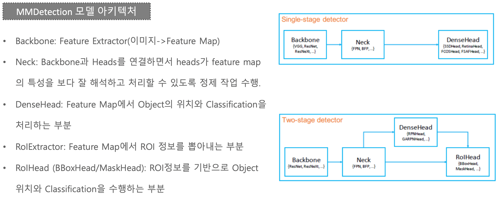
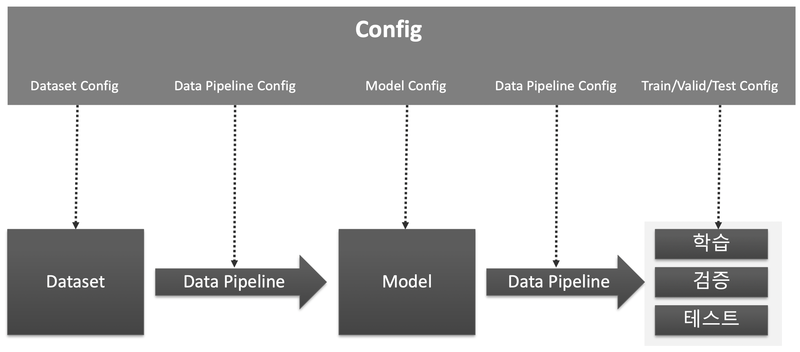
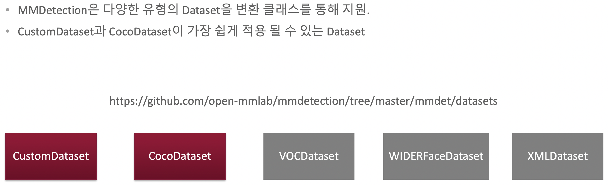
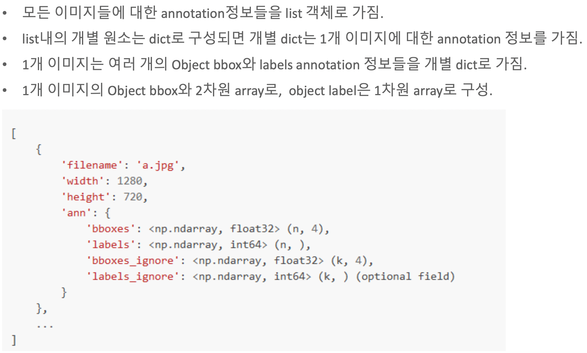
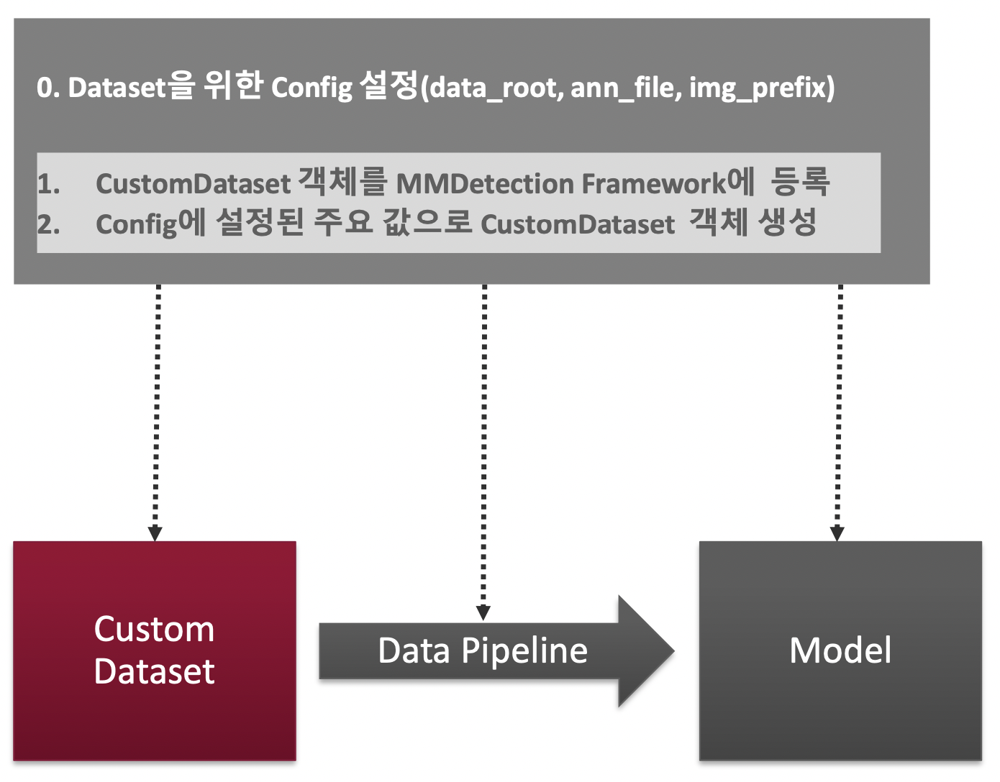
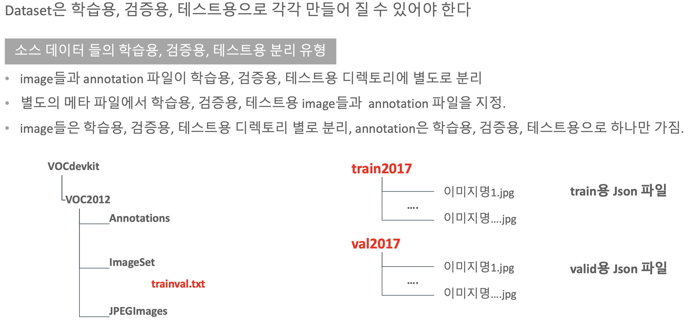

```{r setup, include=FALSE}
knitr::opts_chunk$set(echo = TRUE, warning = FALSE, message = FALSE, include=TRUE)
if (!require("pacman")) install.packages("pacman")
pacman::p_load(knitr, ggplot2, dplyr, tidyr, plotly, gridExtra, widthr, reticulate)
Sys.setenv(PATH=paste0(Sys.getenv("PATH"), ":/opt/homebrew/bin:/Users/yoongi/opt/anaconda3/bin/"))
```

---

## 여러 object detection / segmentation을 패키지화

- touchvision
  - Code 기반
  - 지원 알고리즘이 많지 않음

- Detectron2 & MM Detection
  - config 기반


## MM Detection

- 중국 칭화 대학 주도의 open source project
- 최산 다양한 object detection, segmentation 알고르짐을 packages로 구현
- 성능이 뛰어남, config 기반 간편한 파이프라인
- configuration을 통하여 여러 설정들을 customization 가능
- pytouch 기반

#### 모델 아키텍쳐

- 매우 많은 prebuilt 모델
- Two stage detecter의 경우 RoI 부분이 추가됨.

<br>


<br>

#### 주요 구성 요소



<br>



<br>

**MM detection에서 가장 중요한 부분은 CustomDataset과 CocoDatatset이 가장 쉽게 적용 될 수 있는 부분**

## DataSet

<br>

#### 1. PASCAL VCO

- Annotations
- ImageSet
- JPEGImages
- SegmentationClass
- SegmentationObject

<br>

#### 2. MS-COCO

###### 이미지 파일
- Training
- Validation
- Test

#### Json Annotation file
- info : coco dataset 헤더 정보
- license
- images
- annotations
- categories

<br>

#### Custom dataset에 사용되는 포멧

- COCO format
- middle format(아래와 같은 형태)
  - mmdetection의 중립 annotation 포맷 변환. 해당 포맷은 텍스트로 변환하지 않음. 바로 메모리 상의 list로 생성됨.
  - filename, width, height, ann을 Key로 가지는 Dictionary를 이미지 개수대로 가지는 list 생성.
  - filename: 이미지 파일명(디렉토리는 포함하지 않음)
  - width: 이미지 너비
  - height: 이미지 높이
  - ann: bbounding box와 label에 대한 정보를 가지는 Dictionary
  - bboxes: 하나의 이미지에 있는 여러 Object 들의 numpy array. 4개의 좌표값(좌상단, 우하단)을 가지고, 해당 이미지에 n개의 Object들이 있을 경우 array의 shape는 (n, 4)
  - labels: 하나의 이미지에 있는 여러 Object들의 numpy array. shape는 (n, )
  - bboxes_ignore: 학습에 사용되지 않고 무시하는 bboxes. 무시하는 bboxes의 개수가 k개이면 shape는 (k, 4)
  - labels_ignore: 학습에 사용되지 않고 무시하는 labels. 무시하는 bboxes의 개수가 k개이면 shape는 (k,)
<br>



<br><br>




- build-dataset()을 호출하면 위 작업들을 해줌.
- data_root, ann_file, img_prefix 정보를 기반으로 config설정을 이용한 CustomDataset 객체를 생성해줌.

<br><br>




