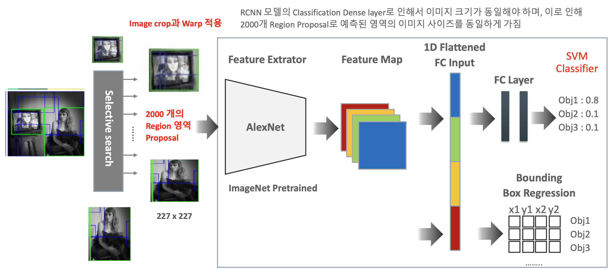
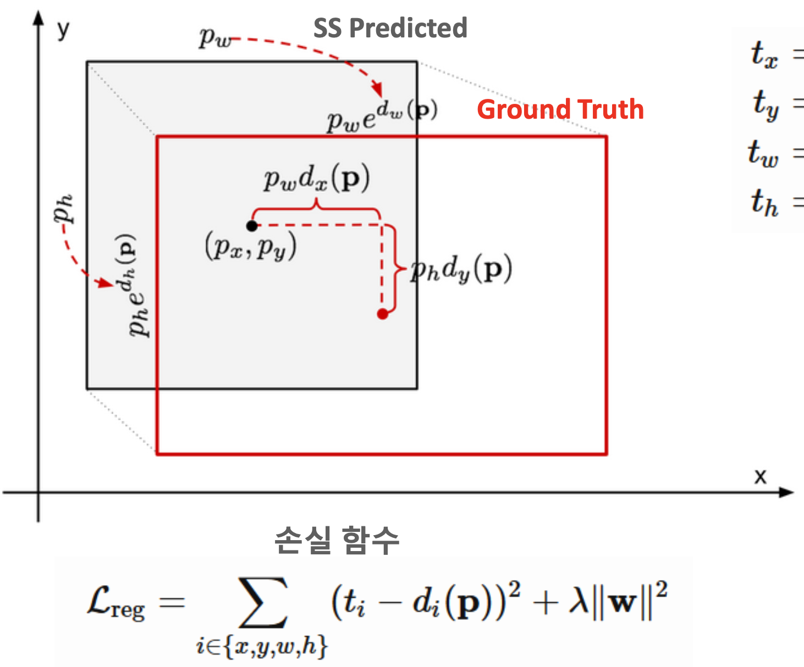
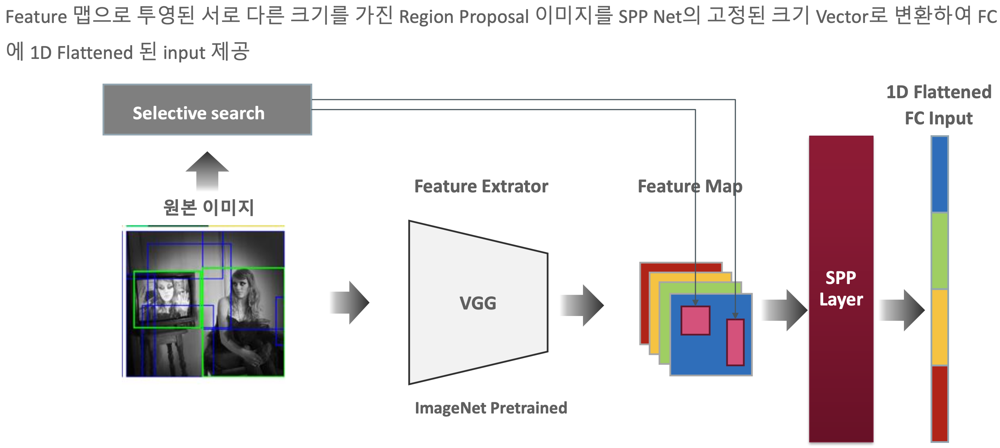
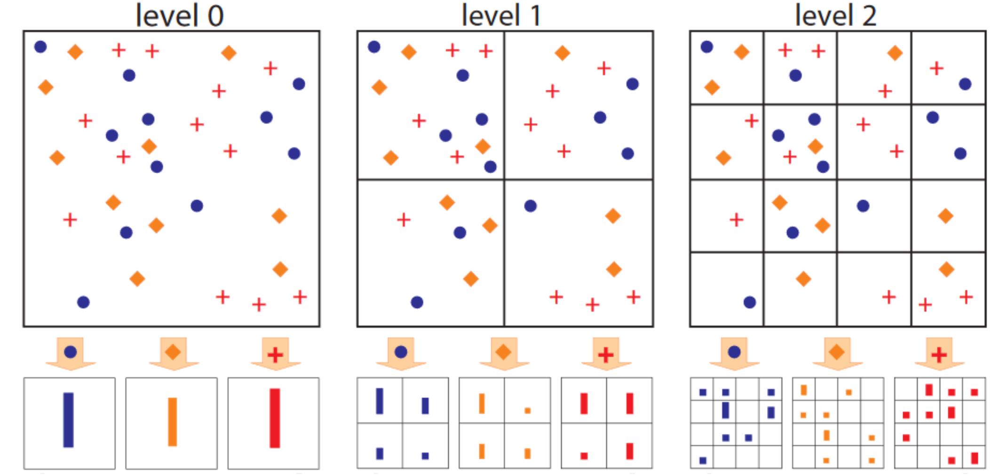
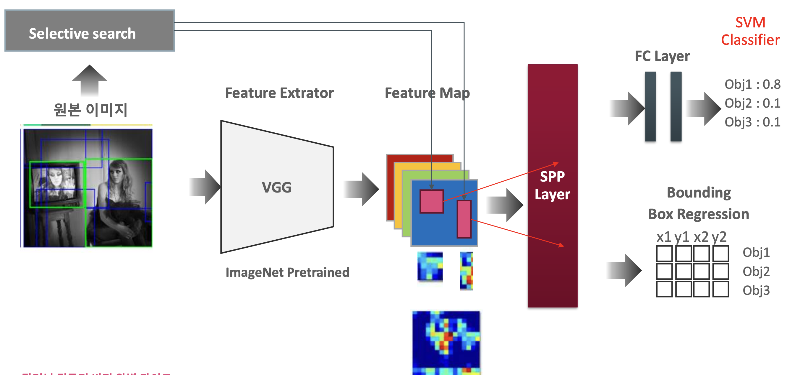
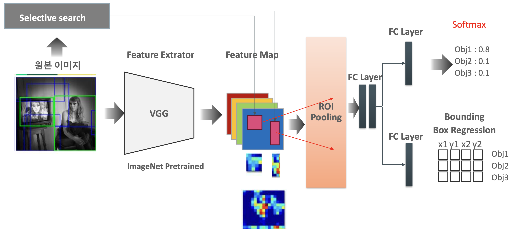
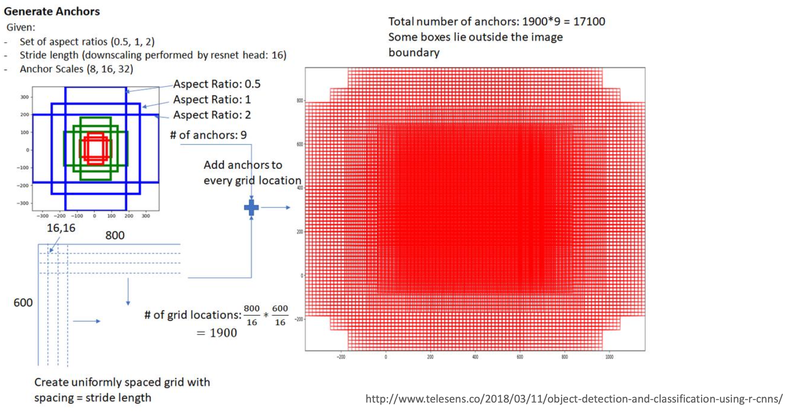
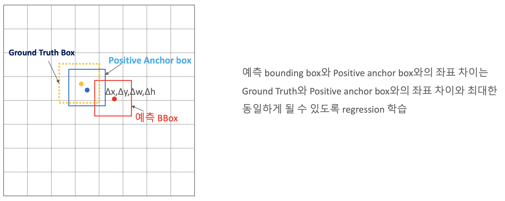
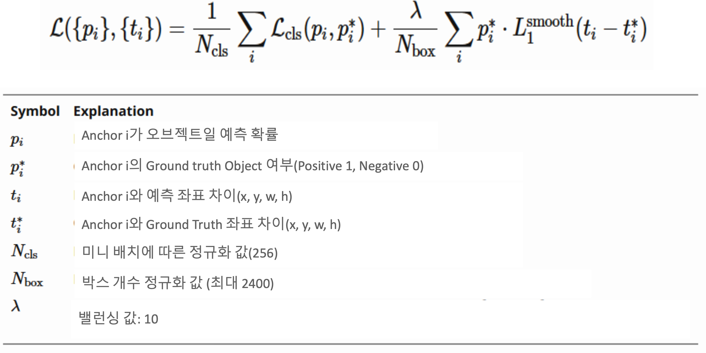

---

## 1. RCNN(Regions with CNN)

- CNN 공부하다보면 어떤 곳에서는 Region Proposal을 network 안에 포함하여 설명하는 글이 있음
- CNN에 Region Proposal을 넣은 것이 RCNN

 

  

1. 단일 이미지에 대해 Selective Search를 이용하여 2000개의 Region proposal
2. Selective Search를 통해 나온 이미지들을 AlexNet에 넣기 위해서는 227*227 image crop
3. 마지막에 classification을 위해 사용했던 softmax 대신 SVM를 채택하여 성능이 향상됨.
 - SVM(Support Vector Machine) : 특정 함수를 만족하는 regression line은 무수히 많지만 그 중에서 잔차의 합이 최소가 되는 line을 찾는 방법
 - 성능은 향상됐으나, 약 2000개의 crop image를 processing하기 때문에 시간이 오래 걸림 
 - object detection 및 region proposal 성능 입증

 

#### RCNN Training

 

1. 데이터 셋 상 Annotation file기반 Ground truth와 Selective Search를 통한 predicted bounding box 확인
2. 1000개의 class로 되어있는 ImageNet으로 Feature Extractor pretraining
3. pretrained model에 사용할 데이터 셋을 fine-tuning
 - Gronud truth와 Selective Search bounding box 간 IoU가 특정 threshold(PASCAL 데이터 셋일 때 0.5일 것으로 보임)이상인 것들만 학습을 시키고 나머지는 background로 find-tuning
4. 만들어진 Feature Map을 이용한 1D FC input이 만들어짐
5. SVM을 이용한 Ground truth만을 기준으로 학습하되 IoU가 0.3 이하는 background로 설정, 0.3이상인데 GT가 아닌 것은 무시???

 

#### Bounding Box Regression

 

- bounding box와 Ground truth의 각 중심점 간 거리가 최소가 되도록 학습
- 우리가 원하는 건 bounding box 변수 P에 대한 tranformation(기존의 vector(여기서는 bounding box P)를 다른 좌표 공간으로 정의하여 달리 표현(여기서는 G_hat)) 함수
- transformation 함수는 CNN layter 중 weight vector가 가미된 손실함수.
- 손실 함수 상에서 사용된 가중치를 학습시키기 위해 ridge regression을 사용하여 regression target를 정의
- 전반적인 bounding box regression의 경우 RCNN상 Selective Search로 찾은 약 2K image에 대해 모두 진행하지 않고 특정 IoU threshold 이상은 값을 가지는 것에 대해서만 진행

{width=60%}

  

## 2. SPP(Spatial Pyramid Pooling) Net

- RCNN의 문제점
  - detection 시간이 너무 오래 걸림
  - image crop & warp로 인해 원래의 이미지가 아닌 다른 이미지로 인식이 됨.

 

#### RCNN 개선 방안

- 원본 이미지에 대해 feature map을 만든 후, bounding box에 대한 부분을 feature map에 mapping하면 해결 될 것으로 보였으나, dense layer 1D FC input size가 고정되지 않아 진행할 수 없었음.
 
 

- 이에 대해 SPP layer를 추가하여 서로 다른 크기를 가진 이미지를 vector로 변환하여 dense layer인 1D FC input을 제공하게끔 함.
- SPP는 CNN image classification에서 서로 다른 이미지의 크기를 고정된 크기로 변환하는 기법으로 소개, 이는 Spatial Pyramid Matching 기법에 근단을 둠
- **SPM(Spatial Pyramid Matching)** : 이미지를 grid layout(위치)을 기반으로 하여 각 feature들이 위치 별로 얼마나 분포하고 있는 지를 파악한 후, 각 위치 별 가장 빈번한 feature의 특성이 반영된 새로운 속성들이 생김. 새롭게 확인된 속성들을 이용하여 새로운 분류를 할 수 있게 됨. 결국 파생 변수...아이디어 싸움

 

- 결국 SPP는 위의 SPM에 max pooling만 추가 적용한 것임.
- 여기서 질문.. 서로 다른 feature map size임에도 불구하고 SPP를 적용하여 문제를 해결할 수 있으나, 2n x 2n의 feature들이여야 1,4,12분면으로 만들 수 있는 거 아니니?

 

  

#### RCNN의 발전

- R-CNN : 한 image에 대해 2천개의 bounding box를 모두 학습하여 별도의 SVM을 통해 classification
 - SPP layer 도입
- Fast R-CNN : 여전히 Selective Search포함되어 있으며 spp layer를 ROI pooling으로 대체. 또한 SVM이 삭제되고 다시 softmax를 도입. End-To-End Network learning(ROI는 제외), Multi-task loss 함수로 classification과 regression를 함께 최적화(loss 줄이기)
- Fater R-CNN : RPN이 추가됨.

* ROI : 방법론이 어떻든 region proposal로 제시된 영역을 일컫는 것으로 보임.

 

#### Fast R-CNN

 

1. 원본 이미지에 대해 한 번만 학습하여 feature map을 만듬
2. Selective Search로 찾은 bounding box에 대하여 이미 만들어놓은 feature map에 mapping
3. ROI logic을 적용하여 resizing, max pooling을 적용하여 크기에 상관없이 정해진 feature extract
4. FC layer > softmax를 통해 분류

 

#### Faster R-CNN

- RNN + Fast R-CNN
- object detection을 구성하는 모든 요소들을 모두 딥러닝만으로 구성한 첫 알고리즘
- Selective Search를 통한 ROI logic을 RPM으로 대체
- GPU 사용으로 빠른 학습
- end-to-end Network 학습
  - 다른 네트워크 개입없이 하나의 네트워크만으로 전체 파이프라인 네트워크를 이루는 것으로 보임.
  - 병렬 처리가 안된다는 안점?이 존재할 거 같다.
  - 분석이 리소스에 의존적이다. 메모리 제한

 

  

#### Anchor Box

- Selective Search를 대체하여 end-to-end network의 기반이 된 기술
- 형성된 feature map을 기준으로 각 grid(value ...)를 기준으로 다음의 특징을 가지는 anchor box를 작성
  - 1배수, 2배수, 3배수 // 1:1, 1:2, 2:1으로 총 9개의 anchor box 적용하는 것이 일반적
  - 근데 yolo v2는 coco 데이터 셋의 bounding box에 k-means clustering을 적용해보니 anchor box를 5개로 설정하는 것이 precision과 recall측면에서 좋은 결과를 낸다고 결론지음.
  

 

  

#### RPN Network

1. 원본 이미지를 이용하여 feature map(n x m x c)을 얻는다.
2. feature map에 대하여 3x3 conv 연산을 적용한다. 크기에 변화가 없도록 padding을 추가한다.
3. 1x1conv을 통하여 channel이 축소화 된 2가지의 feature map을 출력하는데..
  - 이진 분류(object가 있나? 없나?)를 위한 feature map 출력
   : 1x1conv을 이용한 9(anchor boxs) channel feature map
  - bounding box(x, y, w, h)를 위해 1x1conv를 이용한 4(bb coordinate)x9(anchor box) channel feature map

> 근데 RPN에 대해 다른 자료들을 찾아보면 이진 분류를 위한 feature map은 9개가 아니라 9x2 channel의 feature map을 출력한다고 기입되어있음. 이 때의 2는 object가 있냐 없냐에 대한 binary class의 수이고, bounding box coordinate에 해당하는 좌표 정보의 갯수의 컨셉과 동일한 것으로 추정. 설마 sigmoid로 하면 9 channel로 구성해도 알아서 2배수로 해주는건가...

#### Sigmoid vs Softmax

 

N|Sigmoid|softmax
:-:|:---:|:-----:
1|binary-classification|multi-classification
2|sum of P != 1|sum of P == 1
3|output is not real P|real P

 

#### RPN Network configuration

 

#### Positive, Negative anchor box

- 모든 anchor box에 대해 RPN bounding box reg를 적용하지 않는다. 왜? 너무 많으니까
- ground truth와 anchor box간 IoU를 이용하여 positive와 negative로 구분함.
  - IoU가 0.7 이상이거나 가장 높은 anchor는 positive
  - IoU가 0.3보다 낮으면 Negative

 

#### bounding box regression

  

#### RPN 손실함수

#### Faster R-CNN training

 

1. RPN을 선행 학습
2. Fast RCNN Classification / Regression 학습
3. 2의 loss를 이용해 RPN을 fine tuning
4. 전반적인 process를 진행

  

## RCNN Summary

 

 

- RCNN : Selective Search로 인한 2000개의 conv를 적용하여 시간이 오래걸리는 단점 
- Fast RCNN : RCNN의 문제점을 해결하기 위해 ROI를 적용하고 SVM 제거
- Faster RCNN : Selective Search를 제거하고 RPN을 통해 딥러닝으로만 구성된 네트워크

 

-------------

 

